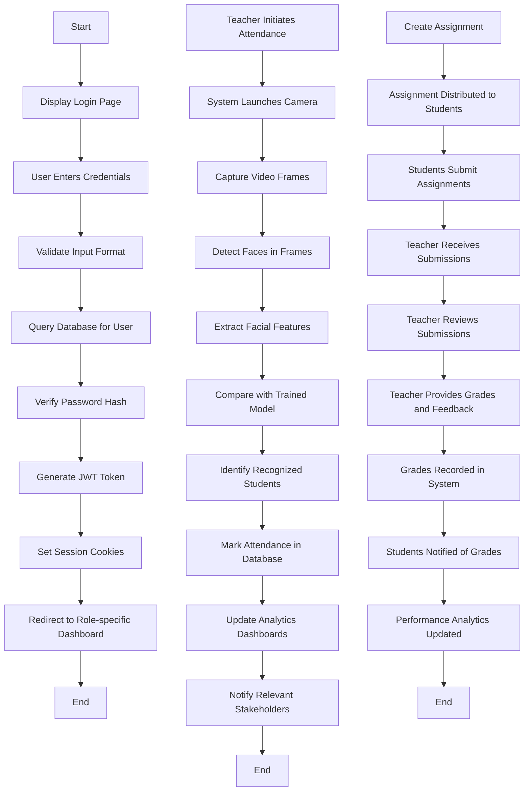

# EduConnect - Virtual Classroom Platform

EduConnect is a comprehensive virtual classroom platform that revolutionizes the educational experience through technology integration. The system combines traditional learning methodologies with modern technological innovations such as smart attendance tracking, AI-based performance prediction, and gamified learning experiences.

## Entity Relationship Diagram

```mermaid
erDiagram
    USER {
        string userId
        string name
        string email
        string password
        string role
        string department
        string studentId
        string teacherId
        date createdAt
        date lastLogin
    }
    
    CLASS {
        string classId
        string name
        string code
        string schedule
        string teacherId
        date createdAt
    }
    
    ATTENDANCE {
        string attendanceId
        string classId
        string studentId
        date date
        string status
        string markedBy
        string notes
        string source
        number confidence
        date createdAt
    }
    
    ASSIGNMENT {
        string assignmentId
        string classId
        string title
        string description
        date dueDate
        date createdAt
    }
    
    GRADE {
        string gradeId
        string assignmentId
        string studentId
        number score
        number maxScore
        string grade
        string feedback
        date createdAt
    }
    
    DEPARTMENT {
        string departmentId
        string name
        string headId
    }
    
    USER ||--o{ CLASS : teaches
    USER ||--o{ CLASS : enrolled_in
    CLASS ||--o{ ATTENDANCE : has_attendance
    USER ||--o{ ATTENDANCE : marks_attendance
    CLASS ||--o{ ASSIGNMENT : has_assignments
    ASSIGNMENT ||--o{ GRADE : has_grades
    USER ||--o{ GRADE : receives_grades
    DEPARTMENT ||--o{ USER : has_users
    USER ||--o{ DEPARTMENT : belongs_to
```

## Architectural Design

### System Architecture Layers:

1. **Client Layer**
   - Web browsers (Chrome, Firefox, Safari, Edge)
   - Mobile-responsive design
   - Progressive Web App capabilities

2. **Presentation Layer**
   - HTML5 templates
   - CSS3 styling with responsive frameworks
   - JavaScript for dynamic interactions
   - AJAX for asynchronous data exchange

3. **Application Layer**
   - Node.js runtime environment
   - Express.js web framework
   - RESTful API endpoints
   - Authentication middleware
   - Business logic controllers

4. **Service Layer**
   - Third-party integrations (email services, cloud storage)
   - Internal microservices (prediction engine, face recognition)
   - Message queuing systems for background processing

5. **Data Layer**
   - MongoDB document database
   - Redis for caching frequently accessed data
   - File storage for uploaded resources
   - Backup and disaster recovery systems

### Component Interactions:
- **API Gateway**: Central entry point for all client requests
- **Load Balancer**: Distributes traffic across multiple server instances
- **Cache Layer**: Reduces database load for frequently requested data
- **Message Queue**: Handles asynchronous tasks like email notifications
- **Logging System**: Centralized logging for monitoring and debugging

## Use Case Diagram

```mermaid
graph TD
    A[Student] --> B[Login/Logout]
    A --> C[View Class Schedule]
    A --> D[Join Live Classes]
    A --> E[Submit Assignments]
    A --> F[View Grades and Feedback]
    A --> G[Check Attendance Records]
    A --> H[Participate in Discussions]
    A --> I[Earn Badges and Rewards]
    
    J[Teacher] --> K[Login/Logout]
    J --> L[Create and Manage Classes]
    J --> M[Take Attendance]
    J --> N[Create and Grade Assignments]
    J --> O[Communicate with Students]
    J --> P[View Student Performance Analytics]
    J --> Q[Generate Reports]
    
    R[HOD] --> S[Login/Logout]
    R --> T[View Department Statistics]
    R --> U[Monitor Faculty Performance]
    R --> V[Analyze Class-wise Performance]
    R --> W[Generate Department Reports]
    
    X[Administrator] --> Y[Login/Logout]
    X --> Z[Manage User Accounts]
    X --> AA[Configure System Settings]
    X --> AB[Monitor System Health]
    X --> AC[Generate Institutional Reports]
    
    AD[Principal] --> AE[Login/Logout]
    AD --> AF[View Overall College Statistics]
    AD --> AG[Monitor Department Performance]
    AD --> AH[Track Enrollment Trends]
    AD --> AI[Generate Strategic Reports]
    
    AJ[System] --> AK[Facial Recognition Attendance]
    AJ --> AL[Performance Prediction]
    AJ --> AM[Gamification Scoring]
    AJ --> AN[Automated Notifications]
    AJ --> AO[Data Backup and Recovery]
```



## Activity Diagram



## Key Features

1. **Smart Attendance System**: Facial recognition-based automated attendance tracking
2. **Performance Analytics**: AI-driven prediction models for student performance
3. **Gamification**: Points, badges, and leaderboards to enhance engagement
4. **Assignment Management**: Complete workflow for creating, distributing, and grading assignments
5. **Grade Management**: Comprehensive grading system with CGPA calculations
6. **Role-based Dashboards**: Customized interfaces for students, teachers, HODs, administrators, and principals

## Technology Stack

- **Frontend**: HTML5, CSS3, JavaScript, Responsive Design
- **Backend**: Node.js, Express.js, RESTful APIs
- **Database**: MongoDB (NoSQL)
- **AI/ML**: Python, OpenCV, Scikit-learn
- **Authentication**: JWT (JSON Web Tokens)
- **Real-time Communication**: WebSocket
- **Deployment**: Cloud-native architecture

## Installation

1. Clone the repository:
   ```bash
   git clone https://github.com/SouvikPachal2004/EduConnect.git
   ```

2. Install backend dependencies:
   ```bash
   cd EduConnect/backend
   npm install
   ```

3. Install frontend dependencies:
   ```bash
   cd ../frontend
   npm install
   ```

4. Install face recognition dependencies:
   ```bash
   cd ../face
   pip install -r requirements.txt
   ```

5. Start the servers:
   ```bash
   # Backend
   cd backend
   npm start
   
   # Frontend (in a new terminal)
   cd frontend
   npm run dev
   
   # Face Recognition System (in a new terminal)
   cd face
   python main.py
   ```

## Configuration

1. Set up MongoDB database
2. Configure environment variables in `.env` files
3. Set up facial recognition training data
4. Configure email services for notifications

## Contributing

1. Fork the repository
2. Create a feature branch (`git checkout -b feature/AmazingFeature`)
3. Commit your changes (`git commit -m 'Add some AmazingFeature'`)
4. Push to the branch (`git push origin feature/AmazingFeature`)
5. Open a pull request

## License

This project is licensed under the MIT License - see the [LICENSE](LICENSE) file for details.

## Contact

For support or queries, please contact the development team at [support@educonnect.edu].